<p align="center">
  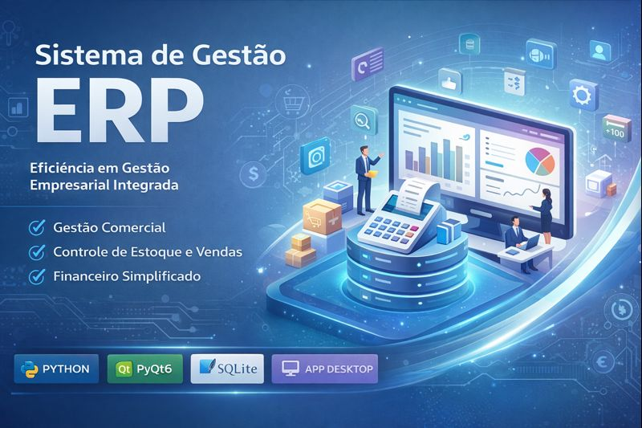
</p>

<h1 align="center"> Sistema de Gestão ERP </h1>

<p align="center">
  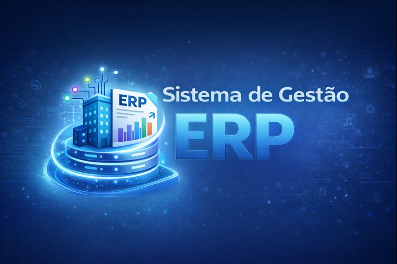
</p>

<p align="center">
  <strong>ERP Desktop desenvolvido em Python, focado em gestão comercial, financeira, estoque e cadastros.</strong>
</p>

<p align="center">
  
  
  
  
</p>

---

##  Sobre o Projeto

Este projeto é uma **versão evoluída, refatorada e independente**, baseada em um **projeto ERP original desenvolvido em grupo**.
Nesta versão, o sistema foi **organizado, corrigido e aprimorado** com foco em:

- estabilidade do sistema
- organização da arquitetura
- padronização do banco de dados
- correção de regras de negócio
- melhorias na experiência do usuário (UI/UX)
- adequação do projeto para **nível portfólio**

O objetivo desta versão é servir como **projeto de portfólio**, demonstrando domínio em **Python, PyQt6, SQLAlchemy, arquitetura de sistemas desktop e banco de dados relacional**.

---

##  Minha Participação no Projeto Original

No projeto ERP original, minha contribuição envolveu:

-  **Arquitetura do banco de dados**
  - Criação e modelagem das tabelas principais
  - Definição das entidades relacionadas a cadastro de pessoas e produtos

-  **Módulo de Cadastros**
  - Desenvolvimento do front-end completo de:
    - Cadastro de Pessoas
    - Cadastro de Produtos
  - Interfaces que serviram como base estrutural para o restante do sistema

-  **Contribuições adicionais**
  - Apoio na organização da lógica de negócio
  - Integração entre front-end e banco de dados

---

##  Evoluções desta Versão (Portfólio)

Nesta versão individual, foram realizadas:

- Remoção de qualquer **banco de dados privado**
- Padronização do banco local em `erp.db`
- Refatoração de código
- Correção de bugs 
- Ajustes visuais e funcionais
- Melhor separação de responsabilidades
- Preparação do projeto para publicação no GitHub

---

##  Screenshots do Sistema

###  Login
<p align="center">
  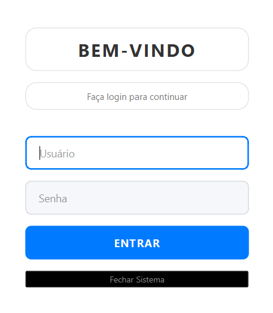
</p>

###  Cadastro de Pessoas
<p align="center">
  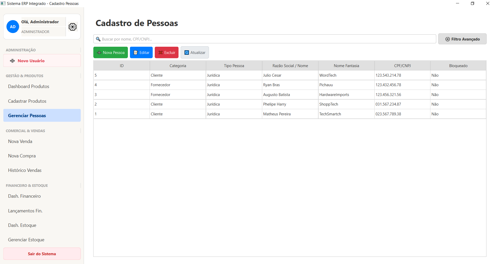
</p>

###  Cadastro de Produtos
<p align="center">
  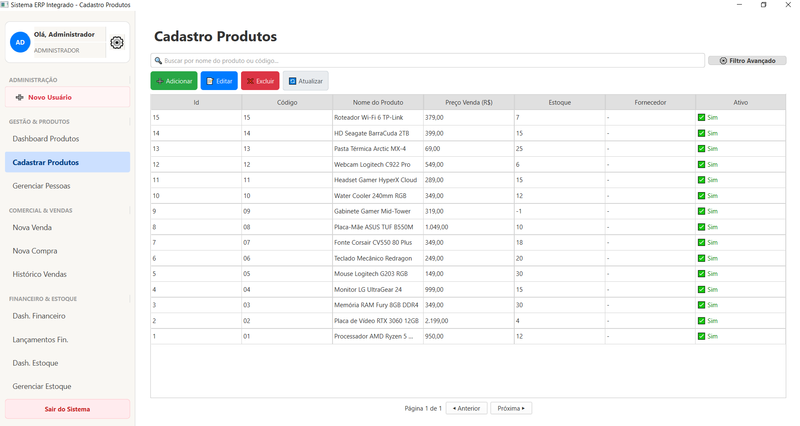
</p>

###  Dashboard Financeiro
<p align="center">
  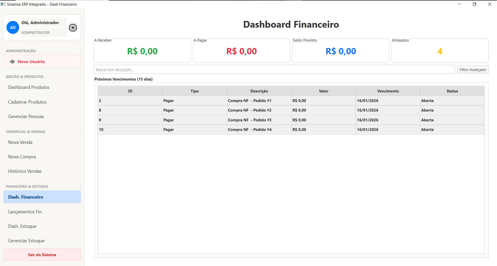
</p>

###  Dashboard Estoque
<p align="center">
  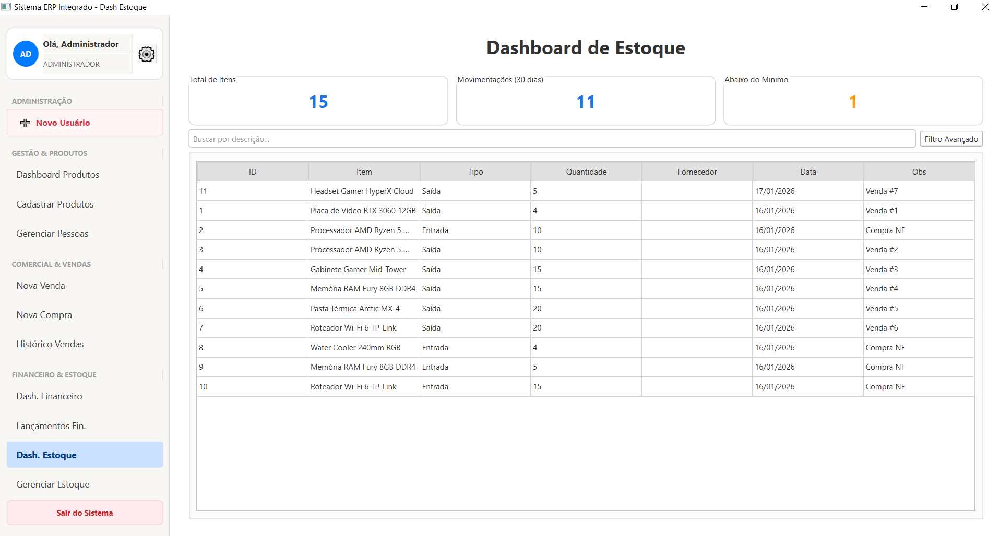
</p>

###  Gerenciamento de Estoque
<p align="center">
  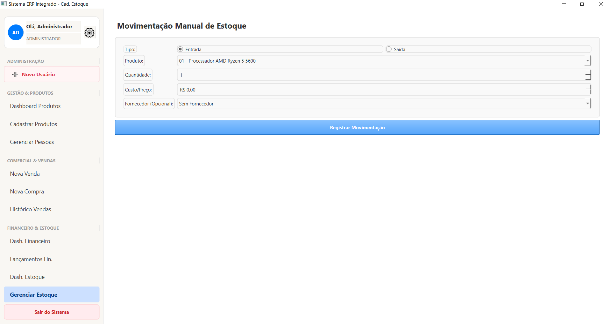
</p>

###  Histórico de Vendas
<p align="center">
  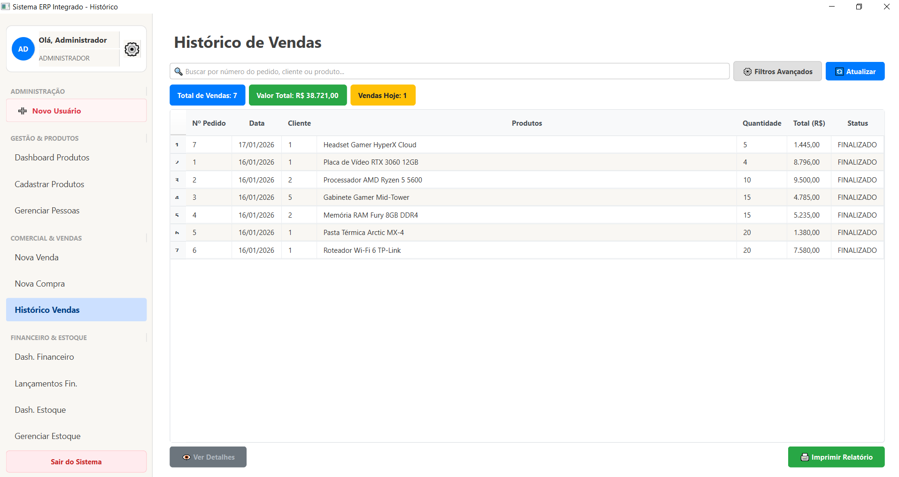
</p>

###  Lançamentos Financeiros
<p align="center">
  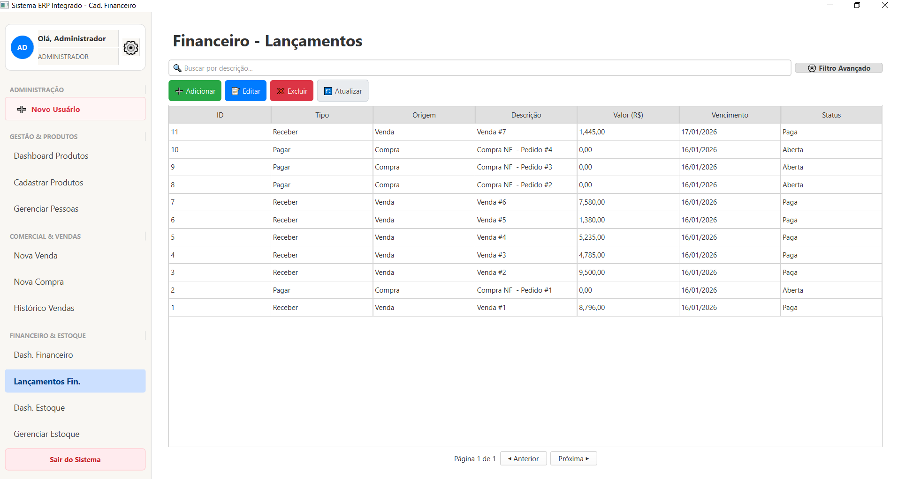
</p>

###  Nova Compra
<p align="center">
  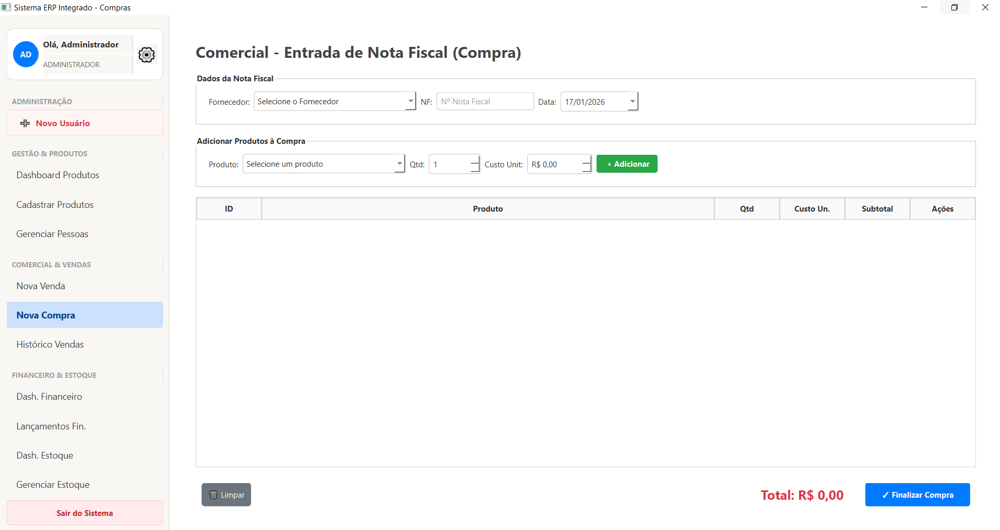
</p>

###  Nova Venda
<p align="center">
  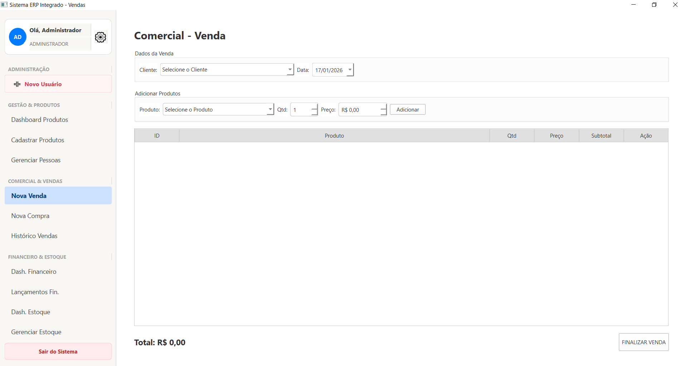
</p>

---

##  Tecnologias Utilizadas

| Categoria | Tecnologia |
|---------|-----------|
| Linguagem | Python 3.10+ |
| Interface Gráfica | PyQt6 |
| ORM / Banco de Dados | SQLAlchemy |
| Banco de Dados | SQLite (erp.db) |
| Arquitetura | MVC |
| Controle de Versão | Git & GitHub |
| Ambiente Virtual | venv |
| Plataforma | Desktop (Windows / Linux) |

---

#  Como Executar o Projeto

##  Clonar o repositório
```bash
git https://github.com/MatheusPereiiira/python-erp.git
cd python-erp
```
##  Crie um ambiente virtual
```bash
python -m venv venv
```

##  Ativar o ambiente virtual
```bash
Windows:
.\venv\Scripts\activate
```
## Linux/macOS:
```bash
source venv/bin/activate
```
##  Instale as dependências
```bash
pip install -r requirements.txt
```
##  Execute o programa
```bash
python main.py
```
---

##  Estrutura do Projeto

```bash
sistema-gestao-erp/
├── assets/                   # Banner e logo do projeto
├── screenshots/              # Capturas de tela da aplicação
├── src/
│   ├── Components/           # Módulos principais do sistema
│   │   ├── Cadastro/         # Lógica de cadastros
│   │   ├── Comercial/        # Vendas, compras e regras comerciais
│   │   ├── Financeiro/       # Lançamentos e controle financeiro
│   │   └── Estoque/          # Controle e movimentação de estoque
│   ├── Models/               # Modelos ORM (SQLAlchemy)
│   ├── Utils/                # Utilitários e validações
│   └── Views/                # Interfaces gráficas (PyQt6)
├── erp.db                    # Banco de dados SQLite (versão portfólio)
├── main.py                   # Ponto de entrada da aplicação
├── main_app.py               # Janela principal e navegação
├── requirements.txt          # Dependências do projeto
├── .gitignore
└── README.md
```

---

##  Licença
- Este projeto está sob a **MIT License**, permitindo uso livre para estudo, modificação e distribuição.

---

##  Autor
**Matheus Pereira** <br> 
- Estudante de Engenharia de Software Faculdade de Nova Serrana <br>
- Projeto Base: https://github.com/SGCFE-ES2FANS/sistema-gestao-erp <br>
- GitHub: https://github.com/MatheusPereiira


---

